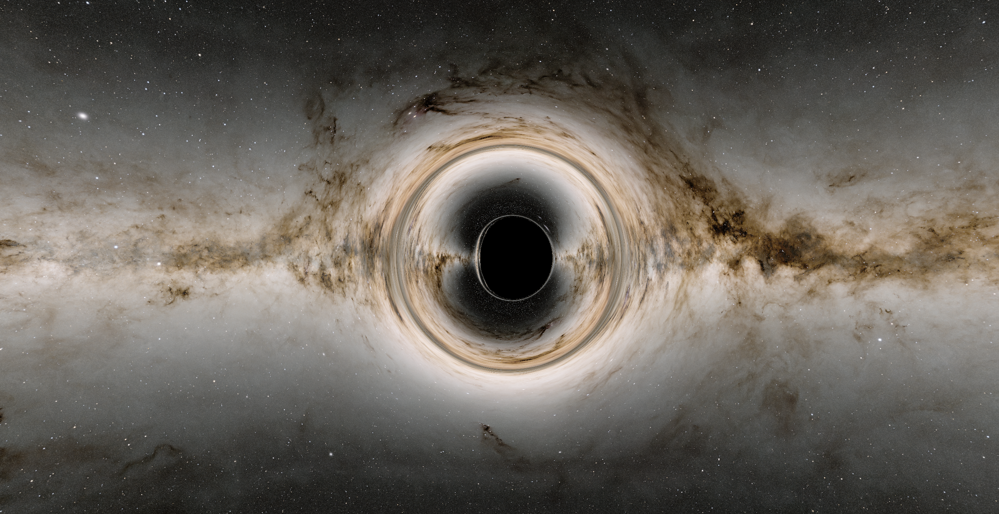

# Blackhole Simulation



This is a plain but realistic real-time raytraced simulation of a black 
hole using OpenGL. By default this uses the [Kerr metric][kerr-link] but a shader 
for the [Schwarzschild metric][schwarz-link] is also present.

This code isn't very well put together as it was my first project with OpenGL.
I plan to hopefully return to this concept in the future and include a
proper writeup for how mathematically everything works. I also hope to include
an accretion disk in future simulations as right now I feel this simulation is
a little bland.

## Building

All dependencies are managed with [CPM][cpm-link] so just run the following:

```bash
mkdir build
cd build
cmake ..
make -j
```

Since the image loader I chose; [SPNG][spng-link] does not rely on zlib this
should be possible to build on Windows but this has not been tested. Check
out [Here][spng-windows-link] for information on linking with [Miniz][miniz-link]
if you would like to try compiling on windows.

[kerr-link]: https://en.wikipedia.org/wiki/Kerr_metric
[schwarz-link]: https://en.wikipedia.org/wiki/Schwarzschild_metric

[cpm-link]: https://github.com/cpm-cmake/CPM.cmake
[spng-link]: https://github.com/randy408/libspng/
[spng-windows-link]: https://github.com/randy408/libspng/
[miniz-link]: https://github.com/richgel999/miniz
